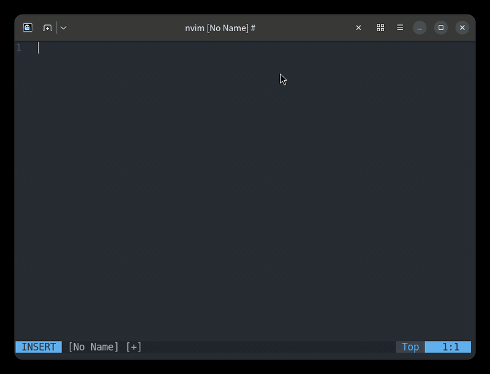
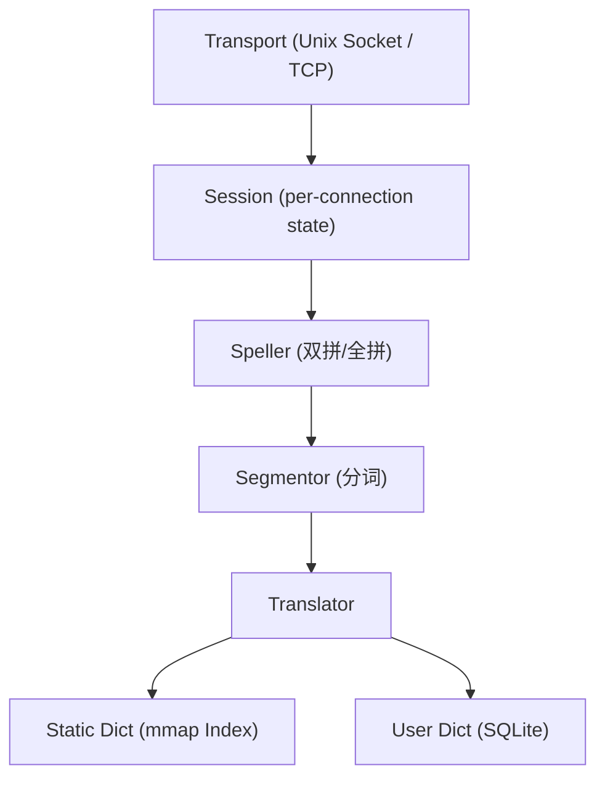

# GoIME

GoIME 是一个基于 Go 语言实现的服务端中文输入法引擎。通过 **Unix Socket** 或 **TCP** 对外提供服务，与 Vim/Neovim 等编辑器深度集成，完全脱离系统输入法框架即可输入中文。

支持小鹤双拼和全拼两种输入方式。



## 架构



## 安装

### 预编译二进制

从 [Releases](https://github.com/jiazhoulvke/goime/releases) 下载对应平台的压缩包，解压后得到三个可执行文件：

| 文件 | 平台 | 架构 |
|------|------|------|
| `goime-<version>-linux_amd64.tar.gz` | Linux | x86_64 |
| `goime-<version>-linux_arm64.tar.gz` | Linux | ARM64（树莓派等） |
| `goime-<version>-linux_armv6.tar.gz` | Linux | ARMv6（树莓派 Zero 等） |
| `goime-<version>-linux_armv7.tar.gz` | Linux | ARMv7（树莓派 3 等） |
| `goime-<version>-darwin_amd64.tar.gz` | macOS | Intel |
| `goime-<version>-darwin_arm64.tar.gz` | macOS | Apple Silicon |
| `goime-<version>-freebsd_amd64.tar.gz` | FreeBSD | x86_64 |

每个包内包含：

- `goimed` — 守护进程
- `goime-dict` — 词库构建工具
- `goimec` — 命令行测试工具
- `LICENSE` — GPLv3
- `README.md` — 本文件

校验：

```bash
# 下载校验和文件
curl -LO https://github.com/jiazhoulvke/goime/releases/download/v0.2.0/goime_v0.2.0_checksums.txt

# 验证压缩包
sha256sum -c goime_v0.2.0_checksums.txt 2>/dev/null | grep OK
```

### 从源码安装

```bash
go install github.com/jiazhoulvke/goime/cmd/goimed@latest
go install github.com/jiazhoulvke/goime/cmd/goime-dict@latest
go install github.com/jiazhoulvke/goime/cmd/goimec@latest
```

## 快速开始

### 1. 准备词库

从 [雾凇拼音](https://github.com/iDvel/rime-ice) 等来源获取词库，导入并编译：

#### 克隆项目到本地
```bash
git clone --depth=1 https://github.com/iDvel/rime-ice
```

#### 导入 Rime 词库（自动检测格式）
```bash
goime-dict import --rime rime-ice/cn_dicts/*.dict.yaml
```

输出：
```text
rime-ice/cn_dicts/8105.dict.yaml: 8610 entries
  → /home/jiazhoulvke/.config/goime/dicts/8105.dict.txt
  → /home/jiazhoulvke/.cache/goime/8105.dict.goime
rime-ice/cn_dicts/41448.dict.yaml: 46014 entries
  → /home/jiazhoulvke/.config/goime/dicts/41448.dict.txt
  → /home/jiazhoulvke/.cache/goime/41448.dict.goime
rime-ice/cn_dicts/base.dict.yaml: 542736 entries
  → /home/jiazhoulvke/.config/goime/dicts/base.dict.txt
  → /home/jiazhoulvke/.cache/goime/base.dict.goime
rime-ice/cn_dicts/ext.dict.yaml: 339299 entries
  → /home/jiazhoulvke/.config/goime/dicts/ext.dict.txt
  → /home/jiazhoulvke/.cache/goime/ext.dict.goime
rime-ice/cn_dicts/others.dict.yaml: 611 entries
  → /home/jiazhoulvke/.config/goime/dicts/others.dict.txt
  → /home/jiazhoulvke/.cache/goime/others.dict.goime
rime-ice/cn_dicts/tencent.dict.yaml: 981803 entries
  → /home/jiazhoulvke/.config/goime/dicts/tencent.dict.txt
  → /home/jiazhoulvke/.cache/goime/tencent.dict.goime
```

### 2. 启动服务
```bash
goimed
```

### 3. 连接测试

```bash
goimec ceui
```
```text
输入: ceui
候选词 (页 1/19, 每页 5):
  →[0] 测试     ceshi (权重:500807)
   [1] 侧视     ceshi (权重:2540)
   [2] 侧室     ceshi (权重:1850)
   [3] 策士     ceshi (权重:955)
   [4] 测      ce (权重:288406)
```

### 4. 安装编辑器插件

- **Vim 8+**：[goime.vim](https://github.com/jiazhoulvke/goime.vim)
- **Neovim**：[goime.nvim](https://github.com/jiazhoulvke/goime.nvim)

## 配置

配置文件路径：`~/.config/goime/goime.toml`

```toml
[general]
# 日志级别：debug / info / warn / error
log_level = "info"
# 监听模式：unix（Unix Domain Socket）或 tcp（TCP 端口）
listen = "unix"
# 监听地址（TCP 模式）
host = "127.0.0.1"
# 监听端口（TCP 模式，0=随机端口，端口号写入 ~/.cache/goime/goime.port）
port = 11527
# Unix Socket 路径，留空自动推导
socket_path = ""
# 空闲超时，所有客户端断开后多久自动退出（0=永不退出）
idle_timeout = "15m"

[scheme]
# 默认输入方案：xiaohe（小鹤双拼）或 fullpin（全拼）
active = "xiaohe"

[dict]
# 静态词库源文件列表
static = ["~/.config/goime/dicts/zhonghua.dict.txt"]
# 用户词库 SQLite 路径
user = "~/.config/goime/user_dict.db"
# 词库二进制索引构建目录
build_dir = "~/.cache/goime/"
# 自动构建开关
auto_build = true

[candidates]
# 每页候选词数量
page_size = 5
# 单次查询最多返回的候选词总数
max_candidates = 100

[user_dict]
# 是否启用用户词库
enabled = true
# 新词初始权重
new_word_weight = 100
# 频率衰减
freq_decay = true
# 衰减率（每次启动将所有词频乘以该系数）
decay_rate = 0.95

[translator]
# 多音节词组最大匹配长度
max_syllables = 4
```

## 通信协议

通过 Unix Socket 使用 JSON-Lines 协议通信，每行一个完整的 JSON 对象。

### 握手

```json
→ {"method":"hello","version":1,"client":"nvim-goime-0.1"}
← {"type":"welcome","version":1,"schemes":["xiaohe","fullpin"],"active":"xiaohe","page_size":5}
```

### 输入查询

```json
→ {"method":"input","key":"u"}
← {"type":"preedit","text":"u","candidates":{"list":[{"text":"如","code":"ru","weight":100}],"page":0,"total":5}}
```

### 选词上屏

```json
→ {"method":"select","index":0}
← {"type":"commit","text":"如"}

→ {"method":"select","index":1"}
← {"type":"commit","text":"测试"}
← {"type":"preedit","text":"vswfuurufa","candidates":{...}}
```

### 方法列表

| 方法 | 参数 | 说明 |
|------|------|------|
| `hello` | `version`, `client` | 握手，交换版本和方案列表 |
| `input` | `key` (a-z) | 输入一个字符 |
| `enter` | — | 上屏原始输入码 |
| `escape` | — | 清空缓冲区 |
| `backspace` | — | 删除最后一个字符 |
| `space` | — | 选首选词或上屏输入码 |
| `select` | `index` | 选择候选词 |
| `arrow` | `dir` | 方向键翻页 |
| `page` | `dir` | 翻页 |
| `set_scheme` | `name` | 切换输入方案 |
| `config` | `page_size`, `schemes` | 更新配置 |

## 命令行工具

### goime-dict

```bash
# 编译词库
goime-dict build dict.txt dict.goime

# 导入 Rime 词库并编译
goime-dict import --rime a.dict.yaml b.dict.yaml

# 合并多个词库为一个
goime-dict merge a.txt b.txt -o merged.goime

# 管理用户词库
goime-dict user export user.db backup.txt
goime-dict user import backup.txt user.db
```

### goimec

```bash
# 查看候选词
goimec ceui

# JSON 格式输出
goimec -json ni

# 选词上屏
goimec -select 0 ceui
```

## 构建

```bash
make build     # 编译所有二进制
make test      # 运行测试
make clean     # 清理编译产物
```

## 性能目标

| 指标 | 实测 | 条件 |
|------|------|------|
| 词库加载（base 19MB / 54万条） | ~86ms | mmap + key scan |
| 词库加载（8105 77KB） | ~0.08ms | mmap |
| 单次查询延迟（P99） | < 0.1ms | map + 懒解析 |
| 并发 session | 无上限 | goroutine per conn |
| 内存占用（base 19MB） | < 5MB | mmap 索引 + 懒解析 |
| 首次启动时间（3词库） | ~150ms | mmap + merge |

## 许可证

GPLv3
